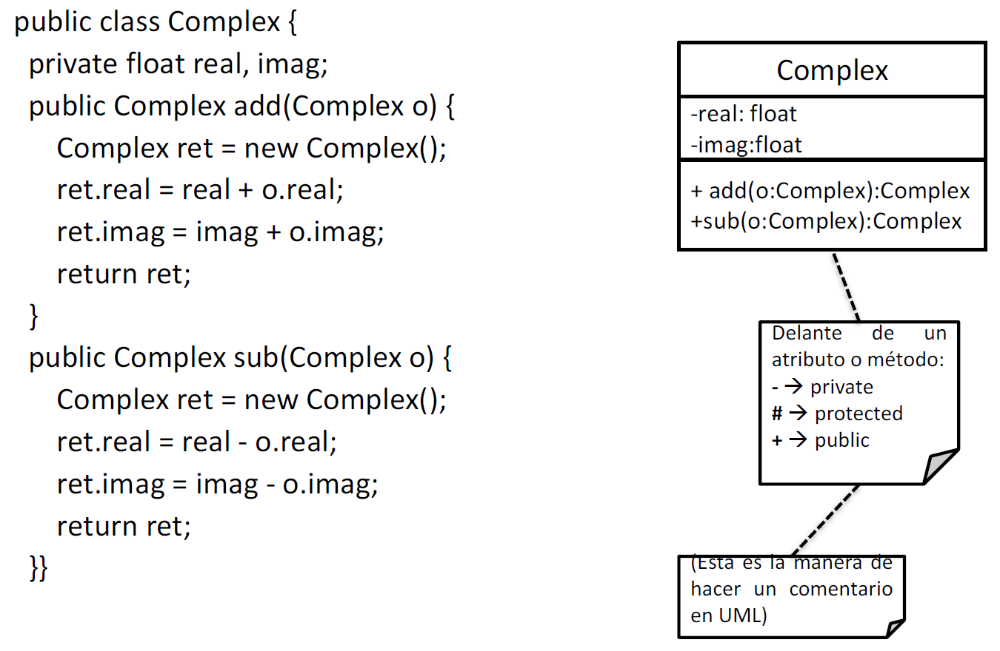
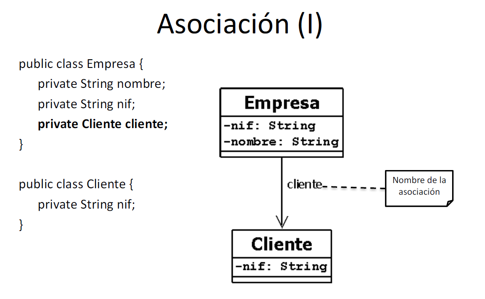
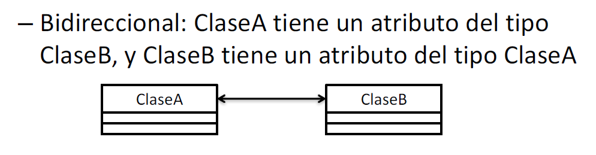
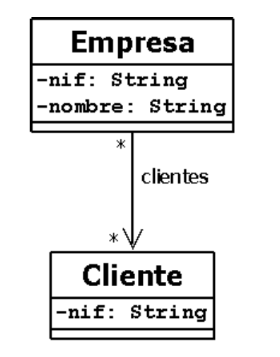
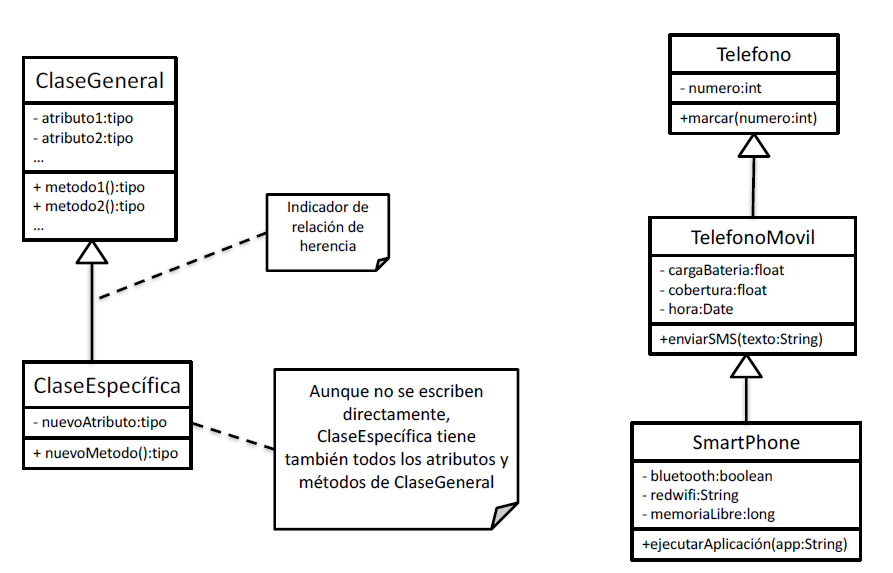

# Java Basics

## 0. Table of Contents
- [1. Executa Java](#1-execute-java)
    - [1.1 Via terminal (linux)](#11-via-terminal-linux)
    - [1.2 Via editor](#12-via-editor)
        - [1.2.1 Package](#121-package)
        - [1.2.2 Compiled Java Artifacts (JAR, WAR, EAR)](#122-compiled-java-artifacts-jar-war-ear)
        -[1.2.3 Why editor?](#123-why-editor)
- [2. Introduction 2 Java](#2-introduction-2-java)
    - [2.1 OOP (Object-oriented programming)?](#21-oop-object-oriented-programming)
    - [2.2. How does Java Work](#22-how-does-java-work)
        - [2.2.1 Java Code and Java API](#221-java-code-and-java-api)
        - [2.2.2 JVM](#222-jvm)
    - [2.3 Java vs JavaScript](#23-java-vs-javascript)
    - [2.4 Java Comments](#24-java-comments)
    - [2.5 Arithmetic Operations](#25-arithmetic-operations)
- [3. Data Type](#3-data-type)
    - [3.1 Variable Naming Convention](#31-variable-naming-convention)
    - [3.2 Simple Data Types](#32-simple-data-types)
        - [3.2.1 Integer Numbers](#321-integer-numbers)
        - [3.2.2 Numerics in floating point](#322-numerics-in-floating-point)
        - [3.2.3 Booleans and Characters](#323-booleans-and-characters)
    - [3.3 Structured Data Types](#33-structured-data-types)
        - [3.3.1 Character Chains (Strings)](#331-character-chains-strings)
        - [3.3.2 Vectors / Arrays (same)](#332-vectors--arrays-same)
    - [3.4 Wrappers](#34-wrappers)
- [4. OOP Object-oriented Programming](#4-oop-object-oriented-programming)
- [4.1 Access Level](#41-access-level)
    - [4.1.1 Private](#411-private)
    - [4.1.2 Protected](#412-protected)
    - [4.1.3 Public](#413-public)
- [4.2 Static / Non-static](#42-static--non-static)
- [4.3 Final](#43-final)
- [4.4 Class](#44-class)
    - [4.4.1 Definition](#441-definition)
    - [4.4.2 Attributes](#442-attributes)
    - [4.4.3 Constructor](#443-constructor)
    - [4.4.4 Methods](#444-methods)
- [5. Operators](#5-operators)
    - [5.1 Logic Operators](#51-logic-operators)
    - [5.2 Java Control Statements](#52-java-control-statements)
        - [5.2.1 If / Else](#521-if--else)
        - [5.2.2 Switch](#522-switch)
    - [5.3 Loops](#53-loops)
        - [5.3.1 For Loop](#531-for-loop)
        - [5.3.2 While Loop](#532-while-loop)
- [6. Collections](#6-collections)
    - [6.1 Set](#61-set)
        - [6.1.1 Object](#611-object)
        - [6.1.2 Features](#612-features)
        - [6.1.3 Instantiation](#613-instantiation)
        - [6.1.4 Methods](#614-methods)
        - [6.1.5 Iteration](#615-iteration)
    - [6.2 List](#62-list)
        - [6.2.1 Object](#621-object)
        - [6.2.2 Features](#622-features)
        - [6.2.3 Instantiation](#623-instantiation)
        - [6.2.4 Methods](#624-methods)
        - [6.2.5 Iteration](#625-iteration)
    - [6.3 Dictionary](#63-dictionary)
        - [6.3.1 Object](#631-object)
        - [6.3.2 Features](#632-features)
        - [6.3.3 Instantiation](#633-instantiation)
        - [6.3.4 Methods](#634-methods)
        - [6.3.5 Iteration](#635-iteration)
- [13. Abstractaction](#13-abstractaction)
    - [13.1 Abstract Class](#131-abstract-class)
    - [13.2 Abstract Methods](#132-abstract-methods)
- [14. Exceptions in Java (Try / Catch)](#14-exceptions-in-java-try--catch)
    - [14.1 Introduction to Exceptions](#141-introduction-to-exceptions)
    - [14.2 Throwing Exceptions](#142-throwing-exceptions)
    - [14.3 Try / Catch](#143-try--catch)
    - [14.4 Custom Exceptions](#144-custom-exceptions)
    - [14.5 Catching Multiple Exceptions](#145-catching-multiple-exceptions)
- [15. InputStream](#15-inputstream)
    - [15.1 Methods](#151-methods)
    - [15.2 Subclasses](#152-subclasses)
    - [15.3 Scanner](#153-scanner)
        - [15.3.1 Getting Keyboard Input](#1531-getting-keyboard-input)
        - [15.3.2 Reading from File](#1532-reading-from-file)
- [16. UML (Unified Modeling Language)](#16-uml-unified-modeling-language)
    - [16.1 Basics](#161-basics)
    - [16.2 Classes Relationship](#162-classes-relationship)
    - [16.3 Inheritance](#163-inheritance)
- [17. TODO](#17-todo)
    
    


## 1. Execute Java

### 1.1 Via terminal (linux)

1. Instalar Java en nuestro SO:

``` bash
$ sudo apt install openjdk-19-jdk-headless
```

2. Definir nuestra primera clase sencillita con metodo main (ejecutable)

``` java
// module = MainClass.java
public class MainClass {
    public static void main(String[] args) {
        System.out.println("Hello World!");
    }
}
```

3. Compilar el modulo

``` bash
$ javac MainClass.java
```

4. Ejecutar el binario java creado

``` bash
$ java MainClass
```

### 1.2 Via Editor

Si queremos utilizar más de una clase en nuestra clase main, deberemos incluir algunos conceptos

#### 1.2.1 Package

Un package es un contenedor de un grupo de clases, interfaces, etc. relacionadas entre si.

Una clase puede declararse como perteneciente a un paquete a través de la cláusula package, la cual debe de ser la primera línea en el código fuente:

``` java
package mipaquete;

class MiClase {
    ...
}
```

El uso de paquetes no es obligatorio, pero si no declaramos a una clase como perteneciente a algún paquete entonces pertenecerán a lo que se llama un Default package (Paquete por defecto) el cual representaría el directorio actual. Esto puede ser usado cuando se trata de pequeños programas, pero es inviable para grandes aplicaciones.

:page_facing_up: **EJEMPLO:**

Supongamos ahora que nuestro programa principal utiliza otros modulos para funcionar, por ejemplo el siguiente:

``` java
package javagames;

public class Bot {
    public static void saluda() {
        System.out.println("Hello World");
    }
}
```

Para utilizarlo dentro de nuestro main:

``` java
package javagames;

public class MainClass {
    public static void main(String[] args) {
        Bot.saluda();
    }
}
```

#### 1.2.2 Compiled Java Artifacts (JAR, WAR, EAR)

In Java, every class remains independent, even during runtime. Each class can be lying around in any folder or zip file and you just have to mention the path to all the required classes during JVM startup.

So, JAR, WAR or EAR files are just zip files containing classes, with a special file extension which conveys the purpose. They are a convenient way of distributing a set of classes.

### 1.2.3 Why editor?

Because without and editor, you should compile all the packages in your project into an artifact (JAR, WAR or EAR) and then execute it. And it is so tedious.

If you use an IDE, it will do it for you just with a button.

## 2. Introduction 2 Java

Java es un lenguaje de programación ampliamente utilizado para codificar aplicaciones web. Ha sido una opción popular entre los desarrolladores durante más de dos décadas, con millones de aplicaciones Java en uso en la actualidad. Java es un lenguaje multiplataforma, orientado a objetos y centrado en la red que se puede utilizar como una plataforma en sí mismo. Es un lenguaje de programación rápido, seguro y confiable para codificarlo todo, desde aplicaciones móviles y software empresarial hasta aplicaciones de macrodatos y tecnologías del servidor.

## 2.1 OOP (Object-oriented programming)?

Si, cumple con los 3 pilares de la programación orientada a objetos:

1. Encapsulación: ocultamiento de los datos miembros de un objeto, es decir, encapsular los atributos y métodos del objeto, de manera que sólo se pueda cambiar mediante las operaciones definidas para ese objeto --> [4.1.1 private](#411-private)

2. Herencia: [8 Herencia](#8-herencia)

3. Polimorfismo: [8.5 Polimorfismo](#85-metodos----polimorfismo)

### 2.2 How does Java work?

Todos los lenguajes de programación son un medio para comunicarse con las máquinas. El hardware de la máquina solo responde a la comunicación electrónica. Los lenguajes de programación de alto nivel como Java actúan como un puente entre el lenguaje humano y el lenguaje del hardware. Para usar Java, un desarrollador debe comprender dos cosas:

1. **Lenguaje Java y API:** Comunicación entre el desarrollador y la plataforma de Java [FRONTEND]
2. **JVM (Java Virtual Machine):** Comunicación entre la plataforma de Java y el SO. [BACKEND]

#### 2.2.1 Java Code and Java API

Java define la sintaxis y la semántica del lenguaje de programación Java. Esto incluye el vocabulario básico y las reglas utilizadas para escribir algoritmos, como tipos de datos inmutables, bloques if/else, bucles, etc.

Las API son componentes de software importantes que se incluyen con la plataforma de Java. Estos son programas de Java preescritos que pueden conectar y reproducir la funcionalidad existente en su propio código. Por ejemplo, podría usar las API de Java para obtener la fecha y la hora, realizar operaciones matemáticas o manipular texto.

Por lo general, cualquier código de aplicación de Java escrito por un desarrollador combinará código nuevo y preexistente de las API de Java y las bibliotecas de Java.

#### 2.2.2 JVM

Java Virtual Machine actúa como una capa de abstracción adicional entre la plataforma de Java y el hardware de la máquina subyacente. El código fuente de Java solo puede ejecutarse en aquellas máquinas en las que se haya instalado previamente JVM.

Java fue el primer lenguaje en combinar Compilado e Interpretación de codigo mediante Java Virtual Machine (JVM). Cualquier archivo Java se compila primero en código de bytes. El código de bytes de Java solo se puede ejecutar en la JVM. Luego, la JVM interpreta el código de bytes para ejecutarlo en la plataforma de hardware subyacente. Entonces, si la aplicación se ejecuta en una máquina con Windows, la JVM la interpretará para Windows. Pero si se ejecuta en una plataforma de código abierto como Linux, la JVM lo interpretará para Linux.

### 2.3 Java vs JavaScript

Java y JavaScript son dos lenguajes de programación diferentes que tienen algunas similitudes, pero también varias diferencias importantes. Mientras que Java es un lenguaje de programación orientado a objetos y se ejecuta en una máquina virtual Java (JVM), JavaScript es un lenguaje de programación de scripts (secuencia de comandos) orientado a objetos.

### 2.4 Java Comments

``` java
// Esto es un comentario
/* Esto es un comentario
que puede durar varias lineas*/
```

## 2.5 Arithmetic Operations

- Suma, resta, multipl, div = +, -, *, /
- Residuo: %
- Division entera:

```java
int a = 4;
int b = 3;
// Division entera
int res = 4 / 3;

// División exacta
double res = (double)4 / (double)3;

// Otra division exacta
double res = 4.0 / 3.0;

// Otra division exacta
double a = 4;
double b = 3;
double res = a / b;

// Residuo
double a % b;
```

>:mega: **NOTA:**
>
> Debemos tener en cuenta que en java, todo lo que definamos tienen un tipo y solo uno de objeto asociado, por tanto las operaciones entre ellos daran un resultado del mismo tipo de objeto

## 3. Data Type

### 3.1 Variable Naming Convention

- Siempre empezar por minuscula
- camelCase
- Constants --> Always mayus

### 3.2 Simple Data Types

#### 3.2.1 Integer Numbers

1. **byte:** solo 1 byte (8bits) de almacenamineto (apenas se usa) --> [-128,127]
2. **short:** usa el doble de almacenamiento que el anterior (apenas se usa) --> [-32.768, 32.767]
3. **int:** emplea 4 bytes de almacenamiento --> [-2<sup>31</sup>, 2<sup>31</sup> -1]
4. **long:**  emplea 8 bytes de almacenamiento --> [-2<sup>63</sup>, 2<sup>63</sup> -1]

#### 3.2.2 Numerics in floating point

1. **float:** emplea 32 bits (apenas se usa) --> --> [1.4e<sup>-45</sup>, 3.4e<sup>38</sup>]
2. **double:** emplea 64 bits --> --> [4.9e<sup>-324</sup>, 1.8e<sup>308</sup>]

>:warning: **WARNING:**
>
>Para los floats, debemos escribir f al final del numero para >que coja bien el formato, siendo innecesario para el resto de tipos
>
>```java
>float pi = 3.1415f
>```

#### 3.2.3 Booleans and Characters

1. **boolean:** true / false
2. **char:** codifica letras individuales, 16 bits UTF-16

### 3.3 Structured Data Types

#### 3.3.1 Character Chains (Strings)

Aunque cuando declaramos una cadena estamos creando un objeto, su declaración no se diferencia de la de una variable de tipo primitivo de las que acabamos de ver:

```java
String name = "Alex";
```

**Methods:**

``` java
name.length(); // Tamaño
name.toUpperCase(); // A mayusculas
name.toLowerCase(); // A minusculas
name.indefOf("a"); // Indice primera ocurrencia a
```

>:mega: **NOTA:**
>
> Se pueden concatenar strings de la siguiente manera: A + B
>
> ```java
> String a = "Hola";
> String b = "Alex";
> String res = a + " " + b;
>```

#### 3.3.2 Vectors / Arrays (same)

Los vectores o arrays son colecciones de datos de un mismo tipo en las que a cada elemento le corresponde una posición identificada por uno o más índices numéricos enteros (llamadas matrices los que trabajar con más de un indice numerico).

- **Declaración**

``` java
int[] vector_enteros = new int[N]; // Vector de enteros
int vector_enteros[] = new int[N]; // Vector de enteros
double[][] matriz_doubles = new double[N][M]; // Matriz de doubles
double matriz_doubles[][] = new double[N][M]; // Matriz de doubles

//También podemos declararlo con sus valores iniciales
int[] vector_enteros = {1, 2, 3, 4, 5}; // Vector de enteros
int vector_enteros[][]= {1, 2, 3, 4, 5}; // Vector de enteros
double[][] matriz_doubles = {{1.3, 2.8},
                             {3.2, 4.4},
                             {5.9, 6.23}}; // Matriz de doubles
double matriz_doubles[][] = {{1.3, 2.8},
                             {3.2, 4.4},
                             {5.9, 6.23}}; // Matriz de doubles

String[] colores = {"Rojo", "Azul", "Verde"}; // Vector de strings
String colores[] = {"Rojo", "Azul", "Verde"}; // Vector de strings
```

- **Utilidades**

``` java
vector_enteros.length;
vector_enteros[3] = 4;
...
```

### 3.4 Wrappers

Java cuenta con tipos de datos estructurados equivalentes a cada uno de los tipos primitivos que hemos visto:

- Byte
- Short
- Integer
- Long
- Float
- Double
- Boolean
- Character

:page_facing_up: **EXAMPLES:**

```java
// Pasando de string a int
String a = "10";
int b = Integer.parseInt(a);

// Pasando de int a string
String c = String.valueOf(b);

// Pasando de int a double
d = (double) b;
```

## 4. OOP Object-oriented Programming

Java es un lenguaje de programación orientado a objetos, que es un modelo de programación en el que el diseño de software se organiza alrededor de datos u objetos, en vez de usar funciones y lógica. Se enfoca en los objetos que los programadores necesitan manipular, en lugar de centrarse en la lógica necesaria para esa manipulación.

### 4.1 Access Level

Cuando estamos definiendo una clase en un lenguaje de programación orientado a objetos, las variables y los métodos pueden estar en uno de los siguientes niveles de acceso:

- private
- protected
- public
- default (depende del lenguaje)

Estas palabras reservadas nos indican el nivel de visibilidad de cada una de las partes dónde lo declaramos y son aplicables a clases, atributos, metodos, instancias... Ya que en java, todo son objetos.

#### 4.1.1 Private

Indica que la variable, metodo, clase o instancia sólo será visible / modificable por los métodos de la misma clase en la que la variable o método se ha declarado.

```java
public class Complex_Number {
    private float real;
    private float imag;
}
```

#### 4.1.2 Protected

Indica que la variable, metodo, clase o instancia solamente será accesible / modificable desde los métodos definidos en las clases que pertenecen al mismo paquete.

```java
public class Complex_Number {
    protected float real;
    protected float imag;
}
```

#### 4.1.3 Public

Indica que la variable, metodo, clase o instancia será accesible de manera universal.

```java
public class Complex_Number {
    public float real;
    public float imag;
}
```

### 4.2 Static / Non-static

Por defecto, las variables y metodos que creemos no seran estáticos. En Java el uso de static indica que en lugar de pertenecer a una instancia del tipo que se acaba de declarar pertenece a un tipo (clase) en si mismo. Es decir, solo se creará una instancia de ese miembro estático el cual será compartida por todas las instancias de la clase.

:page_facing_up: **EXAMPLE:**

En el siguiente código, se pueden definir infinitas instancias de la clase ProductsCounter, cada vez que uno de ellos llame a su función Cart, se incrementará la variable de clase productsNumber. No importa cuantas instancias halla, todas compartiran el mismo valor en la variable.

``` java
public class ProductsCounter {
    private Long productId;
    private LocalDate date;
    
    // El numero de productos
    public static int productsNumber;
    
    public Cart(Long userId, LocalDate date) {
        productsNumber++;
        this.productId = userId;
        this.date = date;
    }
}
```

l uso de static hará uso de la memoria una vez en el área de la clase justo cuando se hace la carga de esa clase. Es indiferente el número de veces que la clase se inicialize, siempre habrá una y solo una copia del campo definido con static.

## 4.3 Final

La palabra clave reservada **final** hace que el compilador genere un error de compilación cuando a una variable final se le intenta asignar un nuevo valor.

Contextos en los que se utiliza:

- **En la declaración de variables:** permite declarar constantes, no se puede asignar un nuevo valor a la variable una vez inicializada
- **En la declaración de un método:** en este contexto una clase que herede un método final no puede redefinirlo en la clase hija, no se puede hacer un override.
- En la declaración de una clase: impide extender de la clase.

## 4.4 Class

### 4.4.1 Definition

Cada clase debe definirse dentro de un modulo con el mismo nombre.

```java
// module name = ComplexNumber.java
class ComplexNumber {
    ...
}
```

### 4.4.2 Atributes

Lo primero a definir en una clase son sus atributos:

```java
class ComplexNumber {
    private float real;
    public float imag;
}
```

- Si los definimos como public, podremos leerlos y modificarlos desde cualquier clase, instancia
- Si los definimos como protected, podremos leerlos y modificarlos desde cualquier clase dentro del package
- Si los definimos como private, necesitaremos de metodos setters y getters para leerlos y modificarlos

### 4.4.3 Constructor

Después de los atributos, lo siguiente a definir es el constructor, como vamos a instanciar los objetos que creamos de una clase:

```java
class ComplexNumber {
    // Atributes
    private float real;
    private float imag;

    // Constructor
    public ComplexNumber(int real, int imag) {
        this.real = real;
        this. image = imag;
    }
}
```

>:mega: **NOTA:**
>
> Fuera del constructor no suele hacer falta volver a referenciar al objeto this para referirse a atributos del objeto (como si hace falta en python). Si lo ponemos, en la mayoría de casos será redundante. En otro sitio donde si hará falta es en los setters si utilizamos el mismo nombre para el parametro que para el atributo:
>
> ```java
> public void setName(name) {
>    this.name = name;
>}
>```
>
> Sin embargo en un get así sería suficiente:
>
> ``` java
> public String setName() {
>    return name;
>}

### 4.4.4 Methods

Son las funciones de java, daben ir asociadas siempre a una clase (si son static) o a una instancia (si no lo son).

```java
// ComplexNumber example
```

>:mega: **NOTA:**
>
>La unica forma de devolver más de un objeto en un metodo es con vectores o contenedores.

## 5. Operators

### 5.1 Logic Operators

- ==: is
- !=: is not
- &&: and
- ||: or
- !: not

### 5.2 Java Control Statements

#### 5.2.1 If / Else

Un ejemplo vale mas que mil palabras:

```java
if (a = "Hola") {
    System.out.println("Me estan saludando");
}
else if (a = "Adios") {
    System.out.println("Se estan despidiendo");
}
else {
    System.out.println("Parece que no se han enterado de la peli");
}
```

#### 5.2.2 Switch

Un ejemplo vale mas que mil palabras:

```java
int i = 2;

switch(i) {
  case 0:
    System.out.println("i es cero.");
    break;
  case 1:
    System.out.println("i es uno.");
    break;
  case 2:
    System.out.println("i es dos.");
    break;
  case 3:
    System.out.println("i es tres.");
    break;
  default:
    System.out.println("i es mayor a tres.");
}
```

### 5.3 Loops

#### 5.3.1 For Loop

Un ejemplo vale mas que mil palabras:

```java
for (int i = 0; i <= N; i = i++){
    ...
}
// O inverso
for (int i = N; i <= 3; i = i--){
    ...
}
```

Pero también hay más opciones para iterar arrays, contenedores...

```java
for (E element : list) {
    ...
}
```

#### 5.3.2 Whilee Loop

Un ejemplo vale mas que mil palabras:

```java
n = 0;
x = 0;
while (n < 3) {
    n++;
    x += n;
}
```

## 6. Collections

Para extender las funcionalidades de los arrays o listas, que se quedan un poco cortas, aparecen estos 3 objetos.

### 6.1 Set

#### 6.1.1 Object

- **Set (*super*)**
- HashSet
- TreeSet

#### 6.1.2 Features

- No tienen orden alguno, tan solo contienen otros objetos
- Un mismo objeto no puede estar repetido en un mismo contenedor!

>:mega: **NOTA:**
>
> Si instanciamos dos objetos nuevos en la creación si se pueden añadir, porque no los asocia como el mismo objeto, lo que si que no podemos meter la misma instancia 2 veces.

#### 6.1.3 Instantiation

```java
import java.util.HashSet;
HashSet<objTipe> setName = new HashSet<objTipe>();
```

#### 6.1.4 Methods

- add(objeto): añade un nuevo objeto al conjunto.
- contains(objeto): devuelve "true" si el objeto que se le pasa como parámetro ya está contenido
- size(): Retorna el numero de objetos
- remove(objeto): elimina el objeto especificado
- clear(): elimina todos los elementos del conjunto
- iterator(): devuelve un iterador al objeto

#### 6.1.5 Iteration

1. Using for:

```java
HashSet<Pintura> paleta = new HashSet<Pintura>();

Pintura pinturaVerde = new Pintura("Verde");
paleta.add(new Pintura("Rojo"));
paleta.add(new Pintura("Azul"));
paleta.add(pinturaVerde);
// En este caso nos dejaría porque no lo asocia al mismo objeto
paleta.add(new Pintura("Azul"));
// Aquí ya si que no se lo va a comer
paleta.add(pinturaVerde);

// For each
for (Pintura p : paleta) {
    System.out.println(p);
}
```

2. Using Iterator Object

```java
HashSet<Pintura> paleta = new HashSet<Pintura>();
// Iterator Declaration
Iterator<Pintura> itPint = paleta.iterator();

paleta.add(new Pintura("Rojo"));
paleta.add(new Pintura("Azul"));
Pintura pinturaVerde = new Pintura("Verde");
paleta.add(pinturaVerde);
// En este caso nos dejaría porque no lo asocia al mismo objeto
paleta.add(new Pintura("Azul"));
// Aquí ya si que no se lo va a comer
paleta.add(pinturaVerde);

// Iterate
while(itPint.hasNext()) {
    Pintura pint = itPint.next();
    System.out.println(pint);
}
```

Ejemplo de HashSet en Main.java

More information in [link1](https://docs.oracle.com/javase/8/docs/api/java/util/HashSet.html), [link2](https://docs.oracle.com/javase/8/docs/api/java/util/Set.html)

### 6.2 List

#### 6.2.1 Object

- **List (*super*)**
- ArrayList
- LinkedList
- Queue
- Vector

#### 6.2.2 Features

- Una lista permite guardar elementos en un determinado orden.
- Cada elemento de una lista puede ser accesible a través de un índice, que indica su orden en la lista.
- Se diferencia de un vector
  - El tamaño no es fijo àredimensionado dinámico
  - Sus elementos no se acceden a través de [ y ], sino a través de los métodos add y get.
  - Si se añade un elemento en medio de la lista, el que estaba en esa posición y los siguientes se mueven una posición hacia atrás.
  - Si se elimina un elemento, los que le seguían se mueven una posición hacia adelante.
- Una lista puede verse como una “pila” de objetos, donde podemos “colar” o “sacar” elementos en medio.

#### 6.2.3 Instantiation

```java
import java.util.HashSet;
List<objTipe> setName = new ArrayList<objTipe>();
```

#### 6.2.4 Methods

- add(objeto): añade un nuevo objeto al final de la lista
- add(posición, objeto): añade un objeto en la posición indicada
- get(posición): obtiene el objeto que está en la posición indicada
- contains(objeto): devuelve "true" si el objeto que se le pasa como parámetro está en la lista
- size(): Retorna el numero de objetos
- remove(objeto): elimina el objeto especificado
- remove(posicion): elimina el objeto de la posición especificada
- clear(): elimina todos los elementos de la lista
- iterator(): devuelve un iterador al objeto

#### 6.2.5 Iteration
- Itarate with for: [same as Sets](#615-iterando-con-for)
- Itarate with Iterator Objects: [same as Sets](#616-iterando-con-iterator)

Same as HashSets

More information in [link1](https://docs.oracle.com/javase/8/docs/api/java/util/List.html), [link2](https://docs.oracle.com/javase/8/docs/api/java/util/ArrayList.html)

### 6.3 Dictionary

#### 6.3.1 Object

- **Map (*super*)**
- HashMap
- TreeMap
- HashTable
- Properties

#### 6.3.2 Features

- Una lista permite guardar elementos en un determinado orden.
- Cada elemento de una lista puede ser accesible a través de un índice, que indica su orden en la lista.
- Se diferencia de un vector
  - El tamaño no es fijo àredimensionado dinámico
  - Sus elementos no se acceden a través de [ y ], sino a través de los métodos add y get.
  - Si se añade un elemento en medio de la lista, el que estaba en esa posición y los siguientes se mueven una posición hacia atrás.
  - Si se elimina un elemento, los que le seguían se mueven una posición hacia adelante.
- Una lista puede verse como una “pila” de objetos, donde podemos “colar” o “sacar” elementos en medio.

#### 6.3.3 Instantiation

```java
import java.util.Map;
import java.util.HashMap;
Map<objetoClave,objetoValor> mapName = new HashMap<objetoClave,objetoValor>();
```

#### 6.3.4 Methods

- **put(clave,valor):** guarda un valor, que será accesible mediante la clave especificada
- **get(clave):** accede al objeto que está guardado según la clave especificada
- **remove(clave):** àborra el objeto que está guardado según la clave especificada
- **keySet():** devuelve un conjunto (Set) con las claves del diccionario
- **values():** devuelve una lista con los valores que hay en el diccionario
- **size():** Retorna el numero de objetos en el diccionario

#### 6.3.5 Iteration

En este caso, los iteradores deben hacerse sobre las Listas de Claves o Valores que podemos extraer del diccionario e iterarlas como si fuesen listas:

- **keySet():** devuelve un conjunto (Set) con las claves del diccionario
- **values():** devuelve una lista (List) con los valores que hay en el diccionario

More information in [link1](https://docs.oracle.com/javase/8/docs/api/java/util/Map.html), [link2](https://docs.oracle.com/javase/8/docs/api/java/util/HashMap.html)

## 7. Inheritance (Subclass and Superclass)

### 7.1 Features

- Una clase puede tener muchas subclases. Sin embargo, una clase solo puede tener una superclase
- En Java, una subclase hereda de su superclase:
  - Atributos
  - Métodos
  - Una subclase NO hereda de su superclase:
    - Constructor

### 7.2 Declaration

```java
class TelePlasma extends Tele {
    ...
}
```

### 7.3 Atributes

Si queremos definir nuevos atributos, es suficiente con definirlos en la subclase

Si por el contrario, queremos obtener atributos de la super clase, deberemos hacer uso de, ya que muchas veces super.atribute no es accesible pues el atributo es privado y se encuentra en otra clase:

```java
super.getAtribute()
```

### 7.4 Constructor

Para extender el constructor es necesario que el constructor de la clase que hereda contenga los atributos tambien de la clase heredada y que en el mismo se indique super(atributo1, atributo2,...)

```java
public class Persona {
    private String nombre;
    private String apellidos;
    private int edad;

    //Constructor
    public Persona (String nombre, String apellidos, int edad) {
        this.nombre = nombre;
        this.apellidos = apellidos;
        this.edad = edad;  
    }
}

public class Profesor extends Persona {
    //Campos específicos de la subclase.
    private String IdProfesor;

    //Constructor de la subclase: incluimos como parámetros al menos los del constructor de la superclase
    public Profesor (String nombre, String apellidos, int edad) {
        super(nombre, apellidos, edad);
        IdProfesor = "Unknown";   
    }
}
```

### 7.5 Examples

```java
public class Pieza {
    
    // Atributos
    private final String name;
    private final String color;

    // Constructor
    public Pieza(String name ,String color) {
        super();
        this.name = name;
        this.color = color;
    }

    // Getters
    public String getName() {
        return name;
    }
    public String getColor() {
        return color;
    }

    // toString
    public String toString() {
        return "Pieza: "+ name + " de color: " + color;
    }
}

public class Peon extends Pieza {
    // Atributos
    private int[] movimiento;

    // Constructor
    public Peon(String name ,String color,int[] movimiento) {
        super(name, color);
        this.movimiento = movimiento;
    }

    public int[] getMovimiento() {
        // return super.name no sería posible, pues es un atributo privado
        return movimiento;
    }

    // toString
    //@Override
    public String toString() {
        // super.name no es accesible por esta clase, pues el atributo es privado
        return "Pieza: "+ super.getName() + " de color: " + super.getColor() + 
        " y que se mueve: " + movimiento[0] +", " + movimiento[1];
    }
}
```

### 7.6 Methods (Polymorphism)

- Para hacer referencia a los metodos de super:

```java
super.method()
```

- Para hacer referencia a los metodos de la clase:

```java
method()
// Tambien se puede usar
// this.method()
```

- Para machacar metodos:

```java
// @Override (optional)
public ... method(...) {
    ...
}
```

Por eso se llama polimorfismo, podemos tener objetos de la super clase, creados como subclases y que ejecuten cada uno de ellos a pesar de ser todos instancias del mismo objeto, metodos y atributos diferentes.

:page_facing_up: **EXAMPLE:**

```java
class Animal {
  public void animalSound() {
    System.out.println("The animal makes a sound");
  }
}

class Pig extends Animal {
  public void animalSound() {
    System.out.println("The pig says: wee wee");
  }
}

class Dog extends Animal {
  public void animalSound() {
    System.out.println("The dog says: bow wow");
  }
}

class Main {
  public static void main(String[] args) {
    Animal myAnimal = new Animal();  // Create a Animal object
    Animal myPig = new Pig();  // Create a Pig object
    Animal myDog = new Dog();  // Create a Dog object
    myAnimal.animalSound();
    myPig.animalSound();
    myDog.animalSound();
}
```

Si nos fijamos, todos son animales, pero al construirlos con el constructor de la subclase cogen metodos y atributos de esta subclase. Eso es lo que se denomina polimorfismo.

### 7.6 Abstractaction

#### 7.6.1 Abstract Class

Las clases definidas como abstractos no pueden ser instanciadas, pero si pueden ser usadas por subclases para tomar metodos y atributos no abstractos.

```java
public abstract class NombreDeLaClase {
    ...
}
```

>:mega: **NOTA:**
>
> Las clases abstractas se crean precisamente para esto, para crear subclases y recordarnos que no podemos instanciar la clase original por X motivo que hayamos decidido nosotros o los desarrolladores de java, además de para poder contener metodos abstractos

#### 7.6.2 Abstract Methods

Los metodos definidos como abstractos NO pueden ser usados. Deben estar forzosamente sobre clases abstractas

- No tienen cuerpo, solamente se llaman methodName(); sin {}
- Los métodos abstractos forzosamente habrán de estar sobreescritos en las subclases. Si una subclase no implementa un método abstracto de la superclase tiene un método no ejecutable, lo que la fuerza a ser una subclase abstracta. Para que la subclase sea concreta habrá de implementar métodos sobreescritos para todos los métodos abstractos de sus superclases.

```java
public class NombreDeLaClase {
    public abstract ... methodName();
}
// OR =========
public abstract class NombreDeLaClase {
    public abstract ... methodName();
}
```

>:mega: **NOTA:**
>
> Los metodos abstractos sólo puedeb existir dentro de una clase abstracta. De esta forma se evita que haya métodos que no se puedan ejecutar dentro de clases concretas. Visto de otra manera, si una clase incluye un método abstracto, forzosamente la clase será una clase abstracta.

## 8. Exceptions in Java (Try / Catch)

### 8.1 Introducción a las Excepciones

La idea de las excepciones es ejecutar trozos de codigo mas o menos grandes suponiendo que todo va bien (sin tener que preguntar a cada función si se ejecuta correctamete o tiene algún error) y si se detecta algun error, saltar a otro codigo alternativo.

Esto se hace con excepciones. Una excepción es un objeto que contiene ciertos datos
que pueden describir un error o situación "anómala" en el programa:

- Tipo de error
- Mensaje descriptivo
- Punto del programa donde sucedió el error

Cuando un método de la API de Java (los que nos vienen por defecto) detecta un error, instancia una excepción y la lanza (throw).

En vez de hacer comprobaciones en cada método susceptible de devolver un error, el programador habilita una o varias partes del código que puedan cazar (catch) esa excepción y tratar el error.

### 8.2 Throwing Exceptions

``` java
throw new Exception(),
throw new Exception("Mensaje de error");
```

Para que un metodo lance una excpeción debemos definirlo de la siguiente manera:

``` java
public float dividir(float a, float b) throws Exception {
    if(b == 0) {
        throw new Exception("División por 0!");
    }
    return a/b;
}
```

### 8.3 Try / Catch

```java
try {
    // código que puede lanzar una excepción.
} 
catch(Exception ex) {
    System.err.println("Sucedió un error: " + ex.getMessage());
    ex.printStackTrace();
}
```

### 8.4 Custom Exceptions

- Creamos la clase Extendiendo Excepciones:

```java
public class UsuarioInexistente extends Exception {
    private String usuario;
    public UsuarioInexistente(String usuario) {
        super("El usuario " + usuario + " no existe");
        this.usuario = usuario;
    }
}
```

- La lanzamos en alguno de nuestros metodos

```java
public class BBDDUsuarios extends {
    ...
    public getUsuario(name) {
        if (objet.get(name) == None) {throw new UsuarioInexistente(name); }
    }
}
```

### 8.5 Catching Multiple Exceptions

Debemos saber que:

- El bloque que caza la excepción padre cazaría también las excepciones hijas. Es decir, si hago catch Exception cazaré todas las excepciones, pues todas las excepciones la extienden.
- Sin embargo el bloque que caza la excepción hija no caza la excepción padre. Es decir, si hago catch UsuarioInexistente no cazaré otras excepciones de tipo Exception. Esto da pie a poder manejar un conjunto de excepciones ordenadamente:

:page_facing_up: **EXAMPLE:**

```java
try {
    String cluster_ID = System.getenv("CLUSTER_ID");
    if (cluster_ID == null) { throw new NullPointerException("CLUSTER_ID cannot be null"); }
    else if (cluster_ID.contains("pre")) {
        // Hacer blablabla
    }
    else if (cluster_ID.contains("pro")) {
        // Hacer blebleble
    }
    else { throw InvalidClusterException("Invalid CLUSTER_ID: " + cluster_ID); }
} catch (InvalidClusterExceptio ex) {
    // Hacer blublublu
    System.err.println("Sucedió un error: " + ex.getMessage());
    ex.printStackTrace();
} catch (NullPointerException ex) {
    // Hacer blublublu
    System.err.println("Sucedió un error: " + ex.getMessage());
    ex.printStackTrace();
} catch (Excpetion e) {
    // Para cualquier otra excepción que no hayamos contemplado
    System.err.println("Sucedió un error: " + ex.getMessage());
    ex.printStackTrace();
}
```

## 9. InputStream

Para leer datos, java utiliza la clase abstracta **InputStream**, clase abstracta que provee métodos básicos para la entrada de datos.

### 9.1 Methods

- int read()
  - Lee un byte (valor 0 a 255) y lo retorna como int
  - Retorna -1 si se ha llegado al final del flujo
- int read(byte[] buffer)
  - Lee un conjunto de bytes y los guarda en el parámetro 'buffer'
  - Retorna el número de bytes leídos, o -1 si se ha llegado al final
- void close()
  - Cierra el flujo de datos, y libera los recursos asociados a éste

>**WARNING:**
>
>Es muy importante llamar a este método cuando no vayamos a utilizar más un stream, ya que si no los recursos podrían quedarse bloqueados por un tiempo durante el cual no se podrían volver a usar

>:mega: **NOTA:**
>
>Los métodos anteriores pueden lanzar una IOException si sucede algún error de E/S

### 9.2 Subclasses

- ByteArrayInputStream: Lee datos de un array de bytes como si de un stream se tratara
  - Constructor: public ByteArrayInputStream(byte[] arrayALeer)
- StringBufferInputStream: Lee datos de un String como si de un stream se tratara
  - Constructor: public StringBufferInputStream(String stringALeer)
- FileInputStream: Lee datos de un archivo de disco
  - Constructores:
    - public FileInputStream(File fichero)
    - public FileInputStream(String nombreFichero)
  - Lanzan: FileNotFoundException si no se encuentra el archivo

### 9.3 Scanner

- La clase Scanner permite leer contenido textual de un InputStream (ya sea por pantalla o de fichero)
- Constructor (entre otros): public Scanner(InputStream streamALeer)

#### 9.3.1 Getting Keyboard Input

```java
import java.util.Scanner;
try {
    int length;    // To hold rectangle's length.
    int width;     // To hold rectangle's width.
    int area;      // To hold rectangle's area

    // Create a Scanner object to read input.
    Scanner console = new Scanner(System.in);

    // Get length from the user.
    System.out.print("Enter length ");
    length = console.nextInt();

    // Get width from the user.
    System.out.print("Enter width ");
    width = console.nextInt();
    console.close();
} catch(FileNotFoundException ex) {
        ex.printStackTrace();
}

// Calculate area.
area = length * width;
// Display area.
System.out.println("The area of rectangle is " + area);
```

#### 9.3.2 Reading from File

```java
import java.util.Scanner;

try {
    Scanner scanner = new Scanner(
    new FileInputStream("./texto.txt"));
    while(scanner.hasNextLine()) {
        String linea = scanner.nextLine();
        System.out.println(linea);
    }
    scanner.close();
} catch(FileNotFoundException ex) {
        ex.printStackTrace();
}
```

## 10. UML (Unified Modeling Language)

### 10.1 Basics

1. Atributos (name : type)

- \- : private
- \# : protected
- \+ : public
- subrayado : static

2. Metodos (name(arg : argType) : returnType)

- \- : private
- \# : protected
- \+ : public
- subrayado : static



### 11.2 Classes relationship





Si lo que tiene es un set, list o map de objetos de otra clase se marca así:



### 10.3 Inheritance




For more information check the following doc: - [UML_Diagram.pg](UML_Diagram.pdf)

## 11. TODO

- [] Acabar el ejemplo de numeros complejos y referencias de md a codigo
- [] Pensar un ejemplo mejor para mezclar sets (conjuntos) con listas en un mismo ejemplo:
  - Ejemplo de set Servicio (whats, linkedin, correo, instagram)
  - Ejemplo de lista Mensajes a responder (objeto con nombre del remitente y contenido)
- [] Mirar como reducir al minimo el programa principal sacando todo lo posible del main
- [] Entender correctamente lo de InputStream
- [] Pensar y ejecturar ejemplos con InputStrem
- [] Pensar y ejecturar ejemplos con excepciones
- [] Quitar todo el codigo que no sean ejemplos y pasar a referencias en Classes.
- [] Añadir un apartado de concurrencia
- [] Relizar el mismo proyecto de testServices que hicimos en el curso de python aquí en java bajo un nuevo path /testServices
